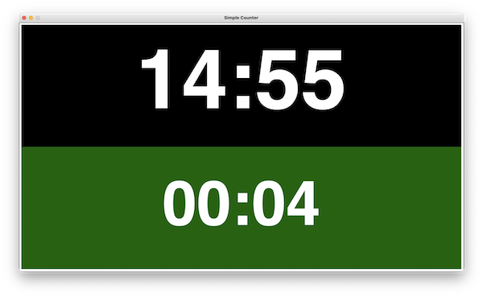

# Counter

First of all, thanks for being here.  Push a chair from over there and make yourself at home.  Let me start explaining this application by saying *I know*.  "Wait .. What?"  I know why you are here.

You typed "counter" or "countdown" in Google and was pulled in a world without end of online counters.  You stopped by because all them are farms for Ads.  In some of them, you can't even see the numbers going down.  There is an Ad blocking your view.  Haha.

There is one more thing that I know.  You won't find what you look for here, and that is fine.  Accept it as fast as you can so you can enjoy my sense of humor.  This app exists to satisfy a very specific need that I have which is most likely different than yours.  It is sad, but not the end of the world.  This code available to you so you can change it to fit your needs.  You are welcome!

The counter above is a native application written in Racket.  Do yourself a favor.  Learn at least one Lisp from the family.  They make trouble, but they are family.  Now, back to the application.  The counter has one or two counters running.  They serve my purpose of timeboxing discussions in some meetings.  Restriction promotes focus and creativity.  When you see that you have 2 minutes to make your point, your brain stop joking around and focus on the task at hand.  But why do you allow two counters?  The top counter tracks the total time to discuss an item, while the bottom one tracks the time a person has to comment about the item before passing the mic to someone else.  There is no rock science here.  It is not a typo, I wrote *rock* instead of *rocket* to test your attention.

Download this code, change the time of your counters in the call `start!` and execute it.  Ops, I forgot to mention.  You need a copy of [Racket Programming Language](https://racket-lang.org/).  Go grab one, google "how to run a racket program" and figure out the rest by yourself.  I believe in you.  Tchau!
